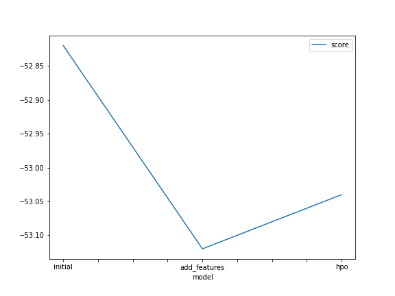

# Report: Predict Bike Sharing Demand with AutoGluon Solution
#### Avi

## Initial Training
### What did you realize when you tried to submit your predictions? What changes were needed to the output of the predictor to submit your results?
Predictions needed to be strictly greater than 0 or else Kaggle would reject them

### What was the top ranked model that performed?
The top-ranked model was the WeightedEnsemble L3, which yields a weighted average of the predictions from the other base models trained by Autogluon

## Exploratory data analysis and feature creation
### What did the exploratory analysis find and how did you add additional features?
EDA found that several features should have been treated as categorical rather than numeric, so that they would be considered different when fed into training the models

### How much better did your model preform after adding additional features and why do you think that is?
The model did marginally better, going from 1.81 to 1.78, though this is small enough that it could be due to random noise

New features contain additional information, which may allow the model to learn new patterns about the target variable, resulting in better performance. 

## Hyper parameter tuning
### How much better did your model preform after trying different hyper parameters?
Model performance was roughly the same: 1.80 compared to the previous 1.81.

### If you were given more time with this dataset, where do you think you would spend more time?
I would augment the data by cross-referencing the timestamps to add additional features. Some examples include stocks, traffic, or gas prices.

### Create a table with the models you ran, the hyperparameters modified, and the kaggle score.
|model|auto_rank|stack_levels|num_bag_sets|score|
|--|--|--|--|--|
|initial|false|0|1|1.81|
|add_features|false|0|1|1.78|
|hpo|true|2|4|?|

### Create a line plot showing the top model score for the three (or more) training runs during the project.

### Create a line plot showing the top kaggle score for the three (or more) prediction submissions during the project.

TODO: Replace the image below with your own.

## Summary
Autogluon yields a moderately effective out-of-the-box-approach for predicting bike-share demand. Adding additional features and tuning hyperparameters had lesser than expected impacts on performance, likely due to the amount of optimization being done "under the hood".